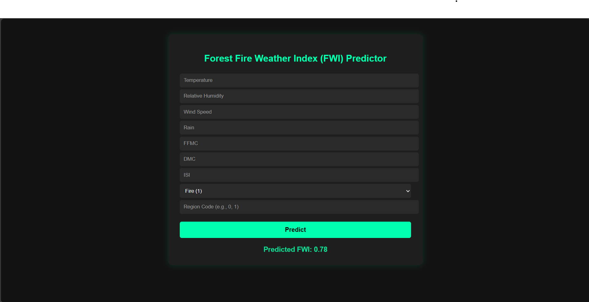

# 🔥 Algerian Forest Fire FWI Predictor

This project predicts the **Fire Weather Index (FWI)** based on meteorological data from two regions of Algeria: **Bejaia** and **Sidi Bel-abbes**.  
The prediction is made using a **Ridge Regression model** and deployed using **Flask** with a simple frontend interface.

---

## 📊 Dataset Overview

- **Total Records**: 244 instances  
- **Regions**:
  - Bejaia (122 instances)
  - Sidi Bel-abbes (122 instances)
- **Time Period**: June 2012 – September 2012  
- **Classes**:
  - Fire: 138 instances
  - Not Fire: 106 instances

---

## 🔧 Attributes

| Feature | Description | Range |
|--------|-------------|-------|
| Date | Day/Month/Year | June–Sept 2012 |
| Temp | Temperature at noon (°C) | 22–42 |
| RH | Relative Humidity (%) | 21–90 |
| Ws | Wind Speed (km/h) | 6–29 |
| Rain | Rainfall (mm) | 0–16.8 |
| FFMC | Fine Fuel Moisture Code | 28.6–92.5 |
| DMC | Duff Moisture Code | 1.1–65.9 |
| DC | Drought Code | 7–220.4 |
| ISI | Initial Spread Index | 0–18.5 |
| BUI | Buildup Index | 1.1–68 |
| FWI | Fire Weather Index (Target) | 0–31.1 |
| Classes | Binary: Fire / Not Fire | - |

---

## ⚙️ Workflow

### ✅ Exploratory Data Analysis (EDA)
- Distribution plots
- Correlation matrix
- Outlier detection

### ✅ Preprocessing
- Feature standardization using `StandardScaler`
- Encoding categorical labels

### ✅ Model Training & Evaluation
- Models tried:
  - Ridge Regression ✅
  - Lasso Regression
  - ElasticNet Regression
- **Best Model**: Ridge Regression  
  - Accuracy (R²): **0.98**

---

## 🖼️ Web App Screenshot




## 🌐 Web App Features

- Built with **Flask**
- Takes user inputs via a web form:
  - Temperature
  - Relative Humidity
  - Wind Speed
  - Rainfall
  - FFMC, DMC, ISI
  - Region (0/1/2)
  - Class (1 = Fire, 0 = Not Fire)
- Predicts **FWI** using the trained model
- Displays the result on the same page

---
## 📤 Output

Predicted **Fire Weather Index (FWI)** is displayed on the homepage after form submission.

---

## 🚀 How to Run Locally

1. Clone the repository

```bash
git clone https://github.com/your-username/fire-fwi-predictor.git
cd fire-fwi-predictor
```
2. Install dependencies

```bash

pip install -r requirements.txt
```
3. Run the Flask app
```bash

python app.py
```
4. Open in browser
```bash
Visit http://localhost:5000 in your browser.
```

